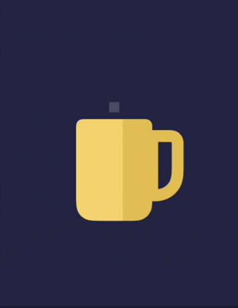

# Swift Views & Effects

A collection of small SwiftUI views and animations, built as playground experiments.

## Contents

- [Scroll Blur Effect](#scroll-blur-effect)
- [Hot Coffee](#hot-coffee)
- [Pulse Animation](#pulse-animation)

## Scroll Blur Effect

A top-aligned blur mask applied to scroll content as it passes under a fixed header, compared against plain (non-blurred) scrolling.

<table>
  <tr>
    <td align="center"><b>Blur Effect</b></td>
    <td align="center"><b>No Blur</b></td>
  </tr>
  <tr>
    <td></td>
    <td></td>
  </tr>
</table>

Source: [ScrollBlurView.swift](animations/ScrollBlurView.swift)

## Hot Coffee

A mesh-gradient coffee cup with an animated rising smoke effect.

Source: [MeshCoffeeAnimation.swift](animations/MeshCoffeeAnimation.swift)

## Pulse Animation

A repeating radial pulse built from a scaling, fading circle.

Source: [CirclePulseAnimation.swift](animations/CirclePulseAnimation.swift)